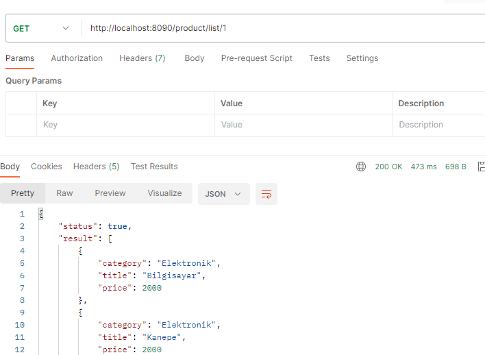

# Spring-RestAPIWorks

 In this work, I used the projection method to list the products in the database according to their categories.
 Also used JpaAuditingListener to detect who added the product and also created and modified time of product.
 Used RestTemplate as a bean to get Json data from url and parse it to Java class and also post for entity 
 on url.

# Technologies :
- Spring Web
- Lombok
- JPA
- Validation
- Projection
- Pagination
- GoogleTinkEncryption
# Software Versions :
- Java 8
- Spring 2.17.13(snapshot)
- H2 Database
- Postman
# Display Images :

 
 
  
   
  
   

